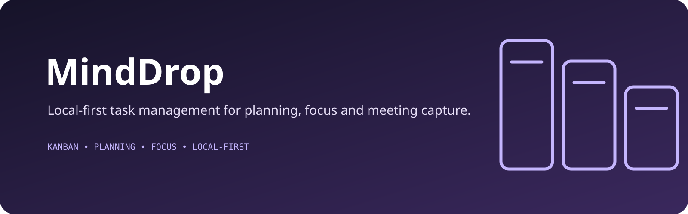

<p align="center">
  
</p>

# MindDrop

AI-assisted task management workspace. Kanban board, planning view, focus mode, meeting capture — built for personal productivity with no auth friction and no cloud lock-in.

Live: **https://mind-drop2-opencode.vercel.app**

---

## What it does

- **Board** — kanban (To Do / In Progress / Done) with priorities, deadlines, tags, reminders, search
- **Timeline** — planning-oriented task view
- **Minutes** — meeting workflow that turns outputs into tasks
- **Focus Mode** — isolated execution view for one task
- **AI assist** — text-based task generation and refinement via MiniMax M2.7

Local-first, no signup. Opens straight to a guest workspace; your tasks live in your browser.

---

## Architecture

```
┌─────────────────────────────────────────────────────────┐
│  Browser (React + Vite)                                  │
│  ┌────────────┐  ┌──────────────┐  ┌──────────────────┐  │
│  │ App.tsx    │→ │ hooks/       │→ │ services/        │  │
│  │ (shell)    │  │ useTasks()   │  │  • ai.ts         │  │
│  └────────────┘  └────────────┘  │  • minimax.ts    │  │
│                                  │  • storage.ts    │  │
│  ┌────────────────────────────┐  │                  │  │
│  │ components/                │←─┘                  │  │
│  │  BoardView, Timeline,      │                     │  │
│  │  Minutes, FocusMode, etc.  │                     │  │
│  └────────────────────────────┘                     │  │
│                          │                           │  │
│                          ▼                           │  │
│                  localStorage (cross-tab sync)       │  │
└──────────────────────────│──────────────────────────────┘
                           │ POST /api/minimax
                           │ { messages, model }
                           ▼
┌──────────────────────────────────────────────────────────┐
│  Vercel Serverless  (api/minimax.ts)                     │
│  - reads process.env.MINIMAX_API_KEY (server-side only)  │
│  - proxies to https://api.minimax.io/v1                  │
│  - returns OpenAI-compatible chat.completion shape       │
└──────────────────────────────────────────────────────────┘
                           │
                           ▼
                    MiniMax M2.7 API
```

**Key design choices:**

- **No backend database.** Tasks persist in `localStorage` with a `storage` event listener for cross-tab sync. Clearing site data = clearing your tasks. Intentional for personal/local-first.
- **Stable guest UID.** Every session uses `uid: 'guest-local'` so the workspace is shared across tabs but never collides with a real account.
- **API key never reaches the browser.** The MiniMax key lives in Vercel env vars (`MINIMAX_API_KEY`, server-side only — no `VITE_` prefix). The browser calls `POST /api/minimax` and the serverless function injects the key. Bundling a paid key into client JS = public key = bill shock.
- **OpenAI-compatible transport.** `services/minimax.ts` uses the standard `chat.completions` shape, so swapping MiniMax for another provider later is a one-file change.

---

## Tech stack

| Layer       | Tech                                    |
|-------------|------------------------------------------|
| UI          | React 18 + TypeScript                    |
| Styling     | Tailwind CSS                             |
| Build       | Vite                                     |
| Hosting     | Vercel (static + serverless functions)   |
| AI          | MiniMax M2.7 (`https://api.minimax.io/v1`)|
| Persistence | Browser `localStorage`                   |
| Tests       | Vitest                                   |

---

## Quick start

Prerequisites: Node.js.

```bash
npm install
npm run dev          # http://localhost:5173
```

For local AI testing, set the env var in a local `.env.local` (gitignored):

```
MINIMAX_API_KEY=sk-...
```

The Vite dev server proxies `/api/*` to a local serverless runner on `:3000` (configured in `vite.config.ts`).

---

## Deploy

The repo auto-deploys to Vercel on push to the default branch.

```bash
git push origin master
```

Required Vercel env var (set per environment — Production / Preview / Development):

```
MINIMAX_API_KEY = sk-...
```

Set via:
```bash
vercel env add MINIMAX_API_KEY production
```

---

## Project structure

```
├── api/
│   └── minimax.ts          # serverless proxy — injects API key server-side
├── components/             # BoardView, Timeline, Minutes, FocusMode, modals
├── hooks/                  # useTasks, useFilters, keyboard shortcuts
├── services/
│   ├── ai.ts               # high-level AI API (tasks generation, etc.)
│   ├── minimax.ts          # browser → /api/minimax client
│   └── storage.ts          # localStorage + cross-tab sync
├── App.tsx                 # shell, view routing, filters, keyboard shortcuts
├── index.tsx               # React entry point
├── types.ts                # Task, Priority, Column, Tag types
├── i18n.ts                 # English + French strings
├── vite.config.ts          # /api dev proxy → :3000
├── vercel.json             # serverless function routing
└── tsconfig.json
```

---

## Status

Personal productivity tool under active iteration. Core experience is solid; no roadmap.

---

## License

Private / unlicensed.